# donegroup [](https://pkg.go.dev/github.com/k1LoW/donegroup) [](https://github.com/k1LoW/donegroup/actions/workflows/ci.yml)   

`donegroup` is a package that provides a graceful cleanup transaction to context.Context when the context is canceled ( **done** ).

> sync.WaitGroup + <-ctx.Done() = donegroup

## Usage

Use [donegroup.WithCancel](https://pkg.go.dev/github.com/k1LoW/donegroup#WithCancel) instead of [context.WithCancel](https://pkg.go.dev/context#WithCancel).

Then, it can wait for the cleanup processes associated with the context using [donegroup.Wait](https://pkg.go.dev/github.com/k1LoW/donegroup#Wait).

``` go
// before
ctx, cancel := context.WithCancel(context.Background())
defer cancel()
```

↓

``` go
// after
ctx, cancel := donegroup.WithCancel(context.Background())
defer func() {
	cancel()
	if err := donegroup.Wait(ctx); err != nil {
		log.Fatal(err)
	}
}()
```

### Basic usage ( [donegroup.Cleanup](https://pkg.go.dev/github.com/k1LoW/donegroup#Cleanup) )

``` mermaid
gantt
    dateFormat  mm
    axisFormat  

    section main
        donegroup.WithCancel :milestone, m1, 00, 0m
        cancel context using cancel() : milestone, m2, 03, 0m
        donegroup.Wait :milestone, m3, 04, 0m
        waiting for all registered funcs to finish     :b, 04, 2m

    section cleanup func1
        register func1 using donegroup.Cleanup :milestone, m1, 01, 0m
        waiting for context cancellation   :a, 01, 2m
        executing func1  :active, b, 03, 3m

    section cleanup func2
        register func2 using donegroup.Cleanup :milestone, m3, 02, 0m
        waiting for context cancellation  :a, 02, 1m
        executing func2 :active, b, 03, 2m
```



```go
package main

import (
	"context"
	"fmt"
	"log"
	"time"

	"github.com/k1LoW/donegroup"
)

func main() {
	ctx, cancel := donegroup.WithCancel(context.Background())

	// Cleanup process func1 of some kind
	if err := donegroup.Cleanup(ctx, func() error {
		fmt.Println("cleanup func1")
		return nil
	}); err != nil {
		log.Fatal(err)
	}

	// Cleanup process func2 of some kind
	if err := donegroup.Cleanup(ctx, func() error {
		time.Sleep(1 * time.Second)
		fmt.Println("cleanup func2")
		return nil
	}); err != nil {
		log.Fatal(err)
	}

	defer func() {
		cancel()
		if err := donegroup.Wait(ctx); err != nil {
			log.Fatal(err)
		}
	}()

	// Main process of some kind
	fmt.Println("main")

	// Output:
	// main finish
	// cleanup func1
	// cleanup func2
}
```

[dongroup.Cleanup](https://pkg.go.dev/github.com/k1LoW/donegroup#Cleanup) is similar in usage to [testing.T.Cleanup](https://pkg.go.dev/testing#T.Cleanup), but the order of execution is not guaranteed.

### Wait for a specified duration ( [donegroup.WaitWithTimeout](https://pkg.go.dev/github.com/k1LoW/donegroup#WaitWithTimeout) )

Using [donegroup.WaitWithTimeout](https://pkg.go.dev/github.com/k1LoW/donegroup#WaitWithTimeout), it is possible to set a timeout for the cleanup processes.

Note that each cleanup process must handle its own context argument.

``` mermaid
gantt
    dateFormat  mm
    axisFormat  

    section main
        donegroup.WithCancel :milestone, m1, 00, 0m
        cancel context using cancel() : milestone, m2, 03, 0m
        donegroup.WaitWithTimeout :milestone, m3, 04, 0m
        waiting for all registered funcs to finish     :b, 04, 1m
        timeout :milestone, m4, 05, 0m

    section cleanup func
        register func using donegroup.Cleanup :milestone, m1, 01, 0m
        waiting for context cancellation   :a, 01, 2m
        executing func  :active, b, 03, 3m
```



```go
ctx, cancel := donegroup.WithCancel(context.Background())

// Cleanup process of some kind
if err := donegroup.Cleanup(ctx, func() error {
	fmt.Println("cleanup start")
	for i := 0; i < 10; i++ {
		time.Sleep(2 * time.Millisecond)
	}
	fmt.Println("cleanup finish")
	return nil
}); err != nil {
	log.Fatal(err)
}

defer func() {
	cancel()
	timeout := 5 * time.Millisecond
	if err := WaitWithTimeout(ctx, timeout); err != nil {
		fmt.Println(err)
	}
}()

// Main process of some kind
fmt.Println("main start")

fmt.Println("main finish")

// Output:
// main start
// main finish
// cleanup start
// context deadline exceeded
```

### [donegroup.Awaiter](https://pkg.go.dev/github.com/k1LoW/donegroup#Awaiter)

In addition to using [donegroup.Cleanup](https://pkg.go.dev/github.com/k1LoW/donegroup#Cleanup) to register a cleanup function after context cancellation, it is possible to use [donegroup.Awaiter](https://pkg.go.dev/github.com/k1LoW/donegroup#Awaiter) to make the execution of an arbitrary process wait.

``` mermaid
gantt
    dateFormat  mm
    axisFormat  

    section main
        donegroup.WithCancel :milestone, m1, 00, 0m
        cancel context using cancel() : milestone, m2, 03, 0m
        donegroup.Wait :milestone, m3, 04, 0m
        waiting for all registered funcs to finish     :b, 04, 1m

    section func on goroutine
        executing go func  :active, b, 01, 4m
        donegroup.Awaiter :milestone, m3, 01, 0m
        completed() :milestone, m3, 05, 0m
```



``` go
ctx, cancel := donegroup.WithCancel(context.Background())

go func() {
	completed, err := donegroup.Awaiter(ctx)
	if err != nil {
		log.Fatal(err)
		return
	}
	time.Sleep(1000 * time.Millisecond)
	fmt.Println("do something")
	completed()
}()

// Main process of some kind
fmt.Println("main")
time.Sleep(10 * time.Millisecond)

cancel()
if err := donegroup.Wait(ctx); err != nil {
	log.Fatal(err)
}

fmt.Println("finish")

// Output:
// main
// do something
// finish
```

It is also possible to guarantee the execution of a function block using `defer donegroup.Awaitable(ctx)()`.

``` go
go func() {
	defer donegroup.Awaitable(ctx)()
	time.Sleep(1000 * time.Millisecond)
	fmt.Println("do something")
}()
```

### Syntax sugar for `go func()` and donegroup.Awaiter ( [donegroup.Go](https://pkg.go.dev/github.com/k1LoW/donegroup#Go) )

[donegroup.Go](https://pkg.go.dev/github.com/k1LoW/donegroup#Go) can execute arbitrary process asynchronously while still waiting for it to finish, similar to [donegroup.Awaiter](https://pkg.go.dev/github.com/k1LoW/donegroup#Awaiter).

``` mermaid
gantt
    dateFormat  mm
    axisFormat  

    section main
        donegroup.WithCancel :milestone, m1, 00, 0m
        cancel context using cancel() : milestone, m2, 03, 0m
        donegroup.Wait :milestone, m3, 04, 0m
        waiting for all registered funcs to finish     :b, 04, 1m

    section func on donegroup.Go
        register and execute func using donegroup.Go :milestone, m3, 01, 0m
        executing func  :active, b, 01, 4m
```



``` go
donegroup.Go(ctx, func() error {
	time.Sleep(1000 * time.Millisecond)
	fmt.Println("do something")
	return nil
}()
```

Also, with [donegroup.Go](https://pkg.go.dev/github.com/k1LoW/donegroup#Go), the error can be received via [donegroup.Wait](https://pkg.go.dev/github.com/k1LoW/donegroup#Wait).

### Syntax sugar for `cancel()` and donegroup.Wait ( [donegroup.Cancel](https://pkg.go.dev/github.com/k1LoW/donegroup#Cancel) )

If cancel() and [donegroup.Wait](https://pkg.go.dev/github.com/k1LoW/donegroup#Wait) are to be executed at the same time, [donegroup.Cancel](https://pkg.go.dev/github.com/k1LoW/donegroup#Cancel) can be used.

``` go
ctx, cancel := donegroup.WithCancel(context.Background())
defer func() {
	cancel()
	if err := donegroup.Wait(ctx); err != nil {
		log.Fatal(err)
	}
}()
```

and

``` go
ctx, _ := donegroup.WithCancel(context.Background())
defer func() {
	if err := donegroup.Cancel(ctx); err != nil {
		log.Fatal(err)
	}
}()
```

are equivalent.
